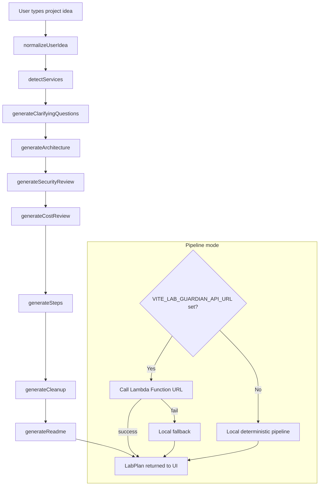

# Cloud Lab Guardian

> A deterministic agentic pipeline that turns a plain-English AWS project idea into a safe, free-tier-aware lab plan — before you touch a single AWS service.

---

## Problem

AWS beginners routinely rack up surprise bills, leave S3 buckets public, hard-code long-term access keys, and skip cleanup. Getting a working, safe architecture diagram used to require either an expensive consultant or hours of reading documentation.

Cloud Lab Guardian solves this in seconds.

---

## What makes it agentic?

Cloud Lab Guardian runs a **seven-stage deterministic pipeline** on every prompt:

1. **Normalize** the raw idea into a clean, consistent string  
2. **Detect** which AWS services the idea requires  
3. **Clarify** by generating targeted clarifying questions (displayed for review)  
4. **Architect** a beginner-safe architecture with free-tier notes  
5. **Security review** — always-on safety warnings (public S3, AdministratorAccess, hardcoded keys, …)  
6. **Cost analysis** — every service bucketed as free-tier eligible, limited-trial/credit eligible, or paid-risk  
7. **Step-by-step guide** + **cleanup checklist** + **exportable README**

Each stage feeds the next. No LLM is required; all logic is pure deterministic TypeScript. An optional Lambda Function URL backend can be plugged in via a single environment variable.

---

## Features

- 🛡️ **Always-on safety warnings** — public S3, `AdministratorAccess`, hardcoded keys flagged on every plan
- 💸 **Free-tier-aware cost review** — cautious AWS Free Tier, credit, and paid-risk notes
- 🔧 **Step-by-step lab guide** — console-first, CloudShell-recommended setup
- 🧹 **Cleanup checklist** — `aws` commands to tear down every resource when the lab is done
- 📄 **README export** — download a portfolio-ready `README.md` for the lab
- 🏷️ **Pipeline mode badge** — shows whether local, Lambda, or fallback mode is active
- ⚡ **No API key required** — fully client-side deterministic by default
- 🔌 **Optional Lambda backend** — set one env var to route to a serverless function

---

## Tech stack

| Layer | Technology |
|---|---|
| Frontend | React 18 + Vite 7 |
| Language | TypeScript 5 |
| Styling | Tailwind CSS + shadcn/ui |
| Icons | lucide-react |
| Routing | wouter |
| Testing | Vitest |
| Package manager | pnpm (monorepo workspace) |
| Optional backend | AWS Lambda Function URL |

---

## Architecture



---

## Safety rules enforced

Every generated plan **always** includes these warnings regardless of the prompt:

| Rule | Detail |
|---|---|
| No `AdministratorAccess` | Always warned against; least-privilege policy recommended |
| No hardcoded AWS keys | Always warned; CloudShell and IAM Identity Center recommended |
| No public S3 | Block Public Access step included whenever S3 is detected |
| AWS Budgets setup | Console-first Zero Spend Budget alert before any deployment |
| Bedrock at $0 | Labeled *Optional Advanced / High Risk — NOT in the $0 MVP path* |
| API Gateway cleanup | Only included when API Gateway was actually selected |
| Lambda Function URL cleanup | Included when Lambda is present without API Gateway |

---

## Cost / free-tier awareness

Cloud Lab Guardian uses a service risk table to classify every detected service:

- **Free-tier eligible / limited allowance** — Lambda, S3, CloudWatch, DynamoDB, and similar services may be free within AWS Free Tier limits or credits, depending on account age, region, usage, and current AWS terms.
- **Limited 12-month / credit-based allowance** — EC2, RDS, API Gateway, CloudFront, and similar services can become paid quickly when limits expire or usage exceeds allowances.
- **Paid risk** — NAT Gateway, Bedrock, SageMaker, larger EC2/RDS configurations, and public endpoints are flagged as high-risk.

The cost review section shows which services you are using, where limited AWS Free Tier allowances or credits may apply, and where charges can begin.

---

## How to run locally

### Prerequisites

- Node.js 18+
- pnpm (`npm install -g pnpm`)

### Install

```bash
git clone https://github.com/YOUR_USERNAME/cloud-lab-guardian
cd cloud-lab-guardian
corepack pnpm install --frozen-lockfile
```

### Start the dev server

```bash
pnpm --filter @workspace/cloud-lab-guardian dev
```

Open [http://localhost:PORT](http://localhost:PORT) — the port is printed in the terminal.

### Optional: copy the environment file

```bash
cp .env.example .env.local
# Edit .env.local to set VITE_LAB_GUARDIAN_API_URL if you have a Lambda backend
```

---

## How to run tests

```bash
# Golden regression suite across 5 canonical prompts
corepack pnpm --filter @workspace/cloud-lab-guardian test

# TypeScript typecheck
corepack pnpm --filter @workspace/cloud-lab-guardian typecheck

# Production build
corepack pnpm --filter @workspace/cloud-lab-guardian build
```

See [TESTING.md](TESTING.md) for a full breakdown of the test suite.

---

## Optional Lambda Function URL integration

Cloud Lab Guardian can route pipeline execution to an AWS Lambda Function URL or compatible backend. This is useful if you want server-side logging, caching, or a shared backend. In Lambda mode, the project idea and form metadata are sent to the configured endpoint.

For Lambda Function URLs, `AWS_IAM` is the safest default where practical. A static frontend cannot call an `AWS_IAM` Function URL directly unless requests are signed or proxied, and AWS credentials must never be placed in frontend code. Direct `VITE_LAB_GUARDIAN_API_URL` browser mode should point only to a browser-callable endpoint; if that is `AuthType NONE`, it is public unauthenticated access and should be limited to tightly restricted demos.

1. Deploy your Lambda function (Node.js 20, handler receives `{ idea, skillLevel, budget, region }`)
2. Set the environment variable:

```bash
VITE_LAB_GUARDIAN_API_URL=https://your-function-url.lambda-url.us-east-1.on.aws/
```

3. The app will call the Function URL first. If it fails, it transparently falls back to the local pipeline and shows an amber **"Lambda failed, using local fallback"** badge.

`VITE_LAB_GUARDIAN_API_URL` is bundled into frontend JavaScript by Vite. It may contain only a browser-callable Lambda URL or compatible backend URL. Do not put API keys, tokens, AWS credentials, or secrets in any `VITE_` variable.

See [DEPLOYMENT.md](DEPLOYMENT.md) for full Lambda setup notes.

---

## Environment variables

| Variable | Required | Default | Description |
|---|---|---|---|
| `VITE_LAB_GUARDIAN_API_URL` | No | — | Browser-callable Lambda Function URL or compatible backend URL. If unset, the local pipeline runs. Do not store secrets here. |
| `BASE_PATH` | No | `/` | Vite base path for static hosting under a subpath. |
| `PORT` | No | `3000` | Port the Vite dev server and preview server bind to. |

See [.env.example](.env.example) for a copy-paste template.

---

## Screenshots

Screenshots coming soon. The expected filenames are documented in [screenshots/README.md](screenshots/README.md), but image links are intentionally omitted until the PNG files are captured so GitHub does not render broken images.

---

## Future improvements

- **Terraform / CDK export** — generate IaC alongside the step-by-step guide
- **Multi-region support** — let users pick a target region and adjust service availability
- **Cost estimate** — pull real AWS pricing API data for estimate ranges
- **Save/share plans** — permalink a generated plan via URL hash or short link
- **Lambda backend with caching** — deduplicate common prompts server-side
- **More service rules** — ECS, EKS, SQS, SNS, EventBridge, Step Functions

---

## Disclaimer

> Generated AWS CLI commands and architecture plans are **educational starting points**. Always review every command before running it against a real AWS account. The authors are not responsible for any AWS charges, data loss, or security incidents resulting from use of this tool.

---

## License

MIT — see [LICENSE](LICENSE) for details.

---

*Cloud Lab Guardian v0.1.0 — Stay Safe. Stay Serverless.*
